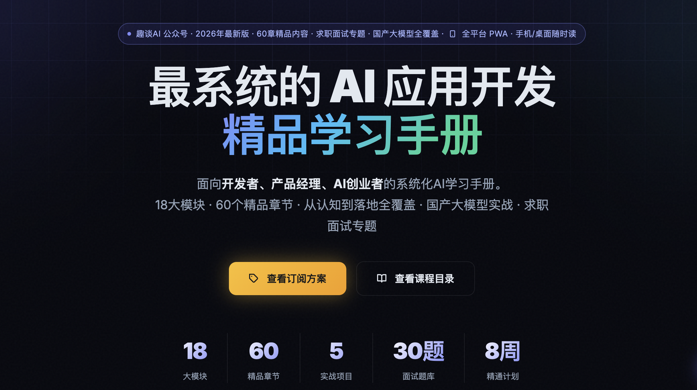

<div align="center">

# 📖 2026 AI全栈学习手册

**趣谈AI公众号出品 · 付费精品小册 · 持续更新**

[](.)
[](.)
[](.)
[](.)
[](.)

</div>

---

<div align="center">

## 一本手册，从零基础到企业级AI落地



**不是泛泛而谈的入门科普，是有代码、有项目、有变现路径的实战手册**

面向 **开发者 · 产品经理 · AI创业者**，覆盖2026年最新主流技术栈、行业最佳实践、避坑指南与5个可落地实战项目。

</div>

---

## ✨ 你将收获什么

| 🛠️ 技术硬实力 | ⚙️ 工程化思维 | 💰 商业变现 |
|:---|:---|:---|
| 独立完成企业级 RAG 知识库 | Skills + CLI + Harness 三层架构 | AI 外包接单（附报价模板）|
| 构建多工具 AI Agent 系统 | Token 成本优化，实测节省 60%+ | AI 独立产品从 0 到 1 上线 |
| 接入 DeepSeek / 通义 / GLM | AI 安全防护与生产级部署 | 30题面试题库，薪资溢价 30-50% |
| 完成 QLoRA 大模型微调 | Docker + K8s + CI/CD 全流程 | 副业冷启动30天行动手册 |
| 多模态（视觉 + 语音）开发 | LLMOps 全链路监控告警 | 从 MVP 到首批付费用户 |

---

## 📚 完整目录（18大模块 · 60章节）

> 点击查看在线版：**[在线阅读地址](https://aibook.mvtable.com)**（购买后解锁）

### 第一部分：快速入门

<details open>
<summary><b>⚡ Module 0 · 30分钟快速上手</b>　<sub>30分钟从零完成第一个AI应用</sub></summary>

- 📄 30分钟快速上手：你的第一个AI应用
- 📄 开发环境搭建：Python / Node.js / VS Code 一键配置
- 📄 AI 应用调试完全手册：报错不再抓瞎

</details>

<details>
<summary><b>🧭 Module Path · 学习路径选择器</b>　<sub>2分钟找到你的专属学习路径</sub></summary>

- 📄 选择你的个性化学习路径（零基础 / 有编程基础 / 资深工程师三条路线）
- 📄 学完这本手册，你能具体做什么？（能力 × 作品 × 收入对照表）

</details>

<details>
<summary><b>📖 Module 1 · 入门认知</b>　<sub>建立AI行业全景认知，明确学习目标</sub></summary>

- 📄 AI行业核心趋势与技术边界（2026年最新）
- 📄 前置知识与快速补全方案

</details>

---

### 第二部分：技术栈与架构

<details>
<summary><b>🏗️ Module 2 · AI技术栈图谱</b>　<sub>分层详解2026年主流AI技术栈，掌握选型方法</sub></summary>

- 📄 基础设施层：AI技术底层基石
- 📄 基础模型层：大模型核心技术体系
- 📄 应用开发层：AI落地核心技术栈
- 📄 Node.js AI 开发：JavaScript 全栈 AI 技术栈
- 📄 工程化与安全层：从Demo到生产
- 📄 国产大模型横向深度对比（2026）
- 📄 DeepSeek 深度实战指南

</details>

<details>
<summary><b>🎯 Module 3 · 应用场景选型</b>　<sub>针对不同场景的技术栈选型指南</sub></summary>

- 📄 通用对话式AI应用开发
- 📄 企业级RAG知识库系统
- 📄 AI Agent智能体开发

</details>

---

### 第三部分：最佳实践精华

<details>
<summary><b>⭐ Module 4 · AI最佳实践精华</b>　<sub>行业一线落地干货，8章系统梳理</sub></summary>

- 📄 提示词工程最佳实践
- 📄 RAG系统全流程最佳实践
- 📄 大模型微调落地最佳实践
- 📄 AI Agent开发避坑指南
- 📄 推理优化与成本控制
- 📄 Function Calling 完整实战：让 AI 能调用任何工具
- 📄 Token 完全指南：原理、计算与省钱技巧
- 📄 **30 个高频 Prompt 模板：直接 Copy 用** ✨

</details>

---

### 第四部分：工程化三层架构（核心特色）

> 本手册独创的 **Skills + CLI + Harness** 黄金三层架构，是区别于其他AI教程的核心竞争力

<details>
<summary><b>⌨️ Module 5 · AI Skills技术</b>　<sub>可复用、标准化的AI能力封装模块</sub></summary>

- 📄 AI Skills：核心定义与技术本质
- 📄 Skills最佳实践与企业级落地

</details>

<details>
<summary><b>💻 Module 6 · AI CLI技术</b>　<sub>AI原生CLI工具与Agent CLI执行能力</sub></summary>

- 📄 AI CLI：核心定义与爆发原因
- 📄 CLI最佳实践与企业级部署

</details>

<details>
<summary><b>🔗 Module 7 · Skills+CLI协同实战</b>　<sub>3天实战清单从0到1落地生产级自动化系统</sub></summary>

- 📄 Skills+CLI协同架构设计
- 📄 3天实战清单 · Day 1：Skills+CLI独立闭环
- 📄 3天实战清单 · Day 2-3：协同联动+项目交付

</details>

<details>
<summary><b>🔧 Module 8 · Harness驾驭工程</b>　<sub>2026年最新AI工业化落地范式</sub></summary>

- 📄 Harness Engineering：核心定义与行业定位
- 📄 Harness行业最佳实践与Skills/CLI关系
- 📄 Harness+Skills+CLI：黄金三层协同架构
- 📄 3天Harness入门实战清单
- 📄 Harness学习资源与4周进阶路径

</details>

---

### 第五部分：5个完整实战项目

<details>
<summary><b>🚀 Module 9-10 · 5个落地实战项目</b>　<sub>从易到难，每个项目含完整代码可直接运行</sub></summary>

| # | 项目名称 | 难度 | 核心技术 |
|---|---------|------|---------|
| 01 | **零基础AI聊天机器人** | ⭐ 入门 | OpenAI API · 流式输出 · 部署上线 |
| 02 | **企业级RAG私有知识库** | ⭐⭐⭐ 中级 | 向量数据库 · 文档解析 · 检索增强 |
| 03 | **多功能AI Agent自动化工作流** | ⭐⭐⭐⭐ 中高级 | LangGraph · 工具调用 · 任务编排 |
| 04 | **开源大模型本地部署与微调** | ⭐⭐⭐⭐ 中高级 | Ollama · QLoRA · 数据集准备 |
| 05 | **高并发企业级AI应用工程化部署** | ⭐⭐⭐⭐⭐ 高级 | Docker · K8s · CI/CD · 监控 |

</details>

---

### 第六部分：工具、变现与商业化

<details>
<summary><b>📦 Module 11 · 精选工具与资源库</b>　<sub>一站式AI开发资源导航</sub></summary>

- 📄 精选 AI 开发资源全景导航（大模型API对比 · 框架速查 · 必读书单）
- 📄 2026 年 AI 开发者日常工具箱（每日必用）
- 📄 AI工具选型决策树（按场景快速定位）

</details>

<details>
<summary><b>💹 Module 12 · AI变现与商业化</b>　<sub>副业接单/知识付费/独立产品/企业服务四条完整路径</sub></summary>

- 📄 AI变现完整路径：副业接单到AI创业
- 📄 副业接单实战：平台入驻到出单全流程
- 📄 AI 独立产品从 0 到 1：MVP 到付费用户
- 📄 AI接单定价策略与报价模板
- 📄 **0到第一单：AI副业冷启动30天行动手册** ✨
- 📄 AI独立产品从MVP到首批付费用户

</details>

---

### 第七部分：进阶专题

<details>
<summary><b>🛡️ Module 13 · AI安全与合规</b>　<sub>生产级AI应用安全必修课</sub></summary>

- 📄 AI安全：攻击面、防御策略与合规红线（Prompt注入·数据脱敏·国内合规红线）

</details>

<details>
<summary><b>🖥️ Module 14 · 多模态AI实战</b>　<sub>视觉/语音/文档三大多模态方向</sub></summary>

- 📄 多模态AI实战：视觉、语音与文档智能
- 📄 视觉 AI 实战：图像分析、OCR 与商品图理解
- 📄 语音 AI 实战：Whisper 转录与语音对话机器人

</details>

---

### 第八部分：求职冲刺专题 ✨ 新增

<details>
<summary><b>💼 Module Career · 求职与职业发展</b>　<sub>AI岗位薪资全景·面试高频题30题·简历模板</sub></summary>

- 📄 2026 AI岗位薪资全景与职业路线图
- 📄 **AI工程师面试高频题 Top 30 + 答题框架** 🔥
- 📄 简历中如何写AI技能才能让HR眼前一亮

</details>

<details>
<summary><b>❓ Module FAQ · 高频问题解答</b>　<sub>技术选型/学习方法/职业路径一次解答</sub></summary>

- 📄 全书高频问题解答（FAQ）

</details>

---

## 🎯 适合哪些人？

```
✅ 零基础想入门AI开发的同学          → 从 Module 0 开始，30分钟跑通第一个应用
✅ 有编程基础想快速转型AI方向         → 直接进 Module 2，掌握技术栈选型与架构设计
✅ 在职工程师想提升AI工程能力         → 重点学 Module 5-8，掌握Skills+CLI+Harness
✅ 想用AI技能增加收入的副业选手       → 重点学 Module 12，副业接单冷启动30天手册
✅ 正在找工作 / 准备跳槽的候选人      → 重点学 Module Career，面试题30题全覆盖
✅ 想独立开发AI产品创业的人           → 学完 Module 9-10，从项目到产品全链路
```

---

## ⏱️ 不同起点的学习预期

| 你的起点 | 每天投入 | 预期完成 | 可达到的水平 |
|---------|---------|---------|------------|
| 零基础小白 | 2小时/天 | 4–6个月 | 初级 AI 应用工程师，可独立交付项目 |
| 有编程基础 | 2小时/天 | 2–3个月 | 中级 AI 应用工程师，可竞争中高级职位 |
| 全栈工程师 | 1.5小时/天 | 6–8周 | 高级 AI 工程师 / AI 架构师 |
| 全职投入学习 | 6小时/天 | 4–6周 | 快速完成 AI 领域系统性转型 |

---

## 💰 购买方案

<table>
<tr>
<td width="50%" valign="top">

### Pro 版　`¥39.9`
~~原价 ¥99~~

**完整阅读权限 · 买断制 · 永久更新**

- ✅ 全部 18 大模块完整内容
- ✅ 60 个精品章节（图文并茂）
- ✅ 30+ 可复用 Prompt 模板库
- ✅ DeepSeek / 通义 / GLM 接入指南
- ✅ 买断制 · 永久阅读 · 持续更新
- ❌ 不含实战项目完整源码
- ❌ 不含项目答疑支持

> 适合：建立AI认知 / 快速了解全貌

</td>
<td width="50%" valign="top">

### 🔥 Plus 版　`¥499`　*最受欢迎*
~~原价 ¥999~~

**包含所有内容 + 源码 + 社群**

- ✅ 包含 Pro 版全部内容
- ✅ 5 个完整 Node.js 实战项目
- ✅ 全套可运行源代码（Github 私仓）
- ✅ DeepSeek / 通义千问 完整接入
- ✅ 项目上线部署实战指南
- ✅ 专属社群 + 文字答疑支持
- ✅ 优先获取新增项目与章节

> 适合：项目落地 / 作品集 / 求职跳槽 / 变现

</td>
</tr>
</table>

---

## 📱 如何购买

> 扫码添加微信，发送「**手册**」即可获取购买链接

<div align="center">


**扫码添加微信 · 发送「手册」**

也可关注公众号 **趣谈AI**，发送「手册」获取购买链接

</div>

---

## 🙋 常见问题

<details>
<summary><b>Q：购买后如何访问？</b></summary>

购买成功后会获得专属访问密钥，在手册首页输入密钥即可永久访问。

</details>

<details>
<summary><b>Q：后续更新如何获得？</b></summary>

买断制，后续所有更新内容均免费获得，无需重复付费。

</details>

<details>
<summary><b>Q：Pro版和Plus版有什么区别？</b></summary>

Pro版包含完整的阅读权限（18模块·60章·30+Prompt模板）。Plus版在此基础上额外提供5个实战项目完整源码、Github私仓、专属答疑社群，适合想直接落地项目的学习者。

</details>

<details>
<summary><b>Q：没有编程基础能学吗？</b></summary>

可以！手册包含完整的「前置知识快速补全方案」和「开发环境一键配置」章节。建议从 Module 0 开始，每天2小时，4-6个月可达到初级AI应用工程师水平。

</details>

<details>
<summary><b>Q：手册支持什么技术栈？</b></summary>

以 **Python + Node.js** 双栈为主，覆盖 LangChain / LangGraph / Hono / FastAPI 等2026年主流框架。国产大模型方面深度覆盖 DeepSeek / 通义千问 / 智谱GLM。

</details>

---

<div align="center">

**趣谈AI · 专注AI应用实战**

© 2026 趣谈AI 出品 · 内容仅供学习参考

</div>
